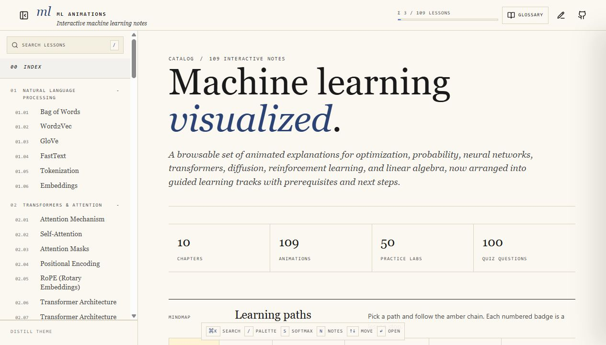
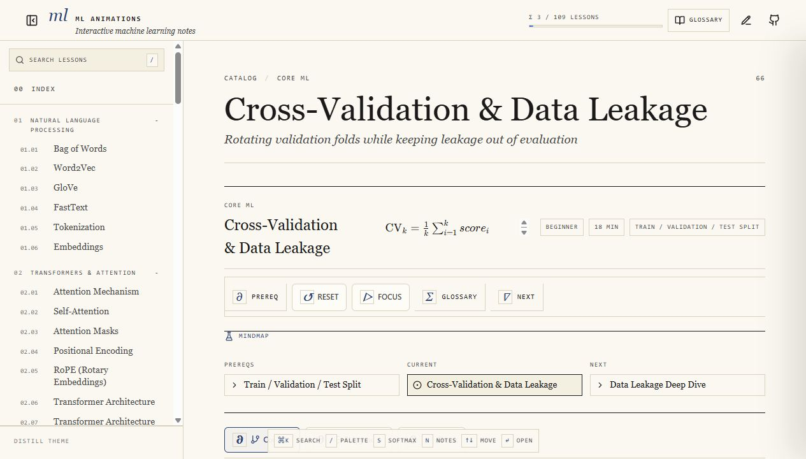
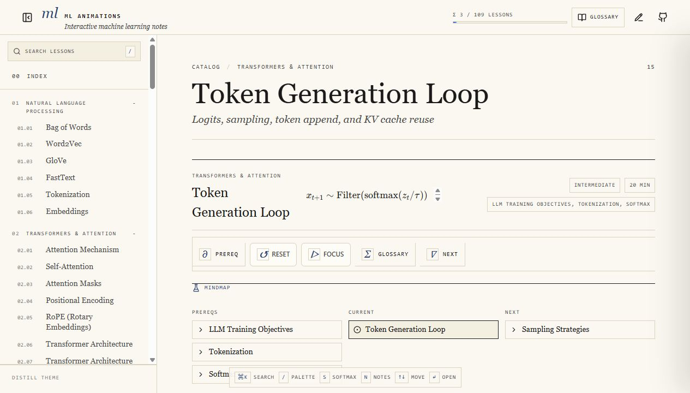
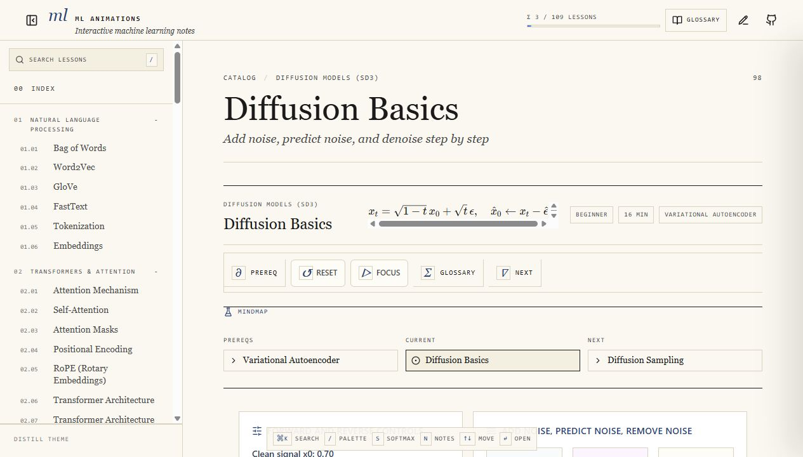

# ML Animations

ML Animations is an interactive curriculum for machine learning, deep learning, language models, retrieval, diffusion, reinforcement learning, and the math behind them.

The project started as a collection of standalone animations. It is now centered on a unified React app with guided paths, lesson metadata, quizzes, labs, glossary links, and local progress tracking.

[Open the live site](https://danielsobrado.github.io/ml-animations/)



## What is inside

- A unified lesson browser with searchable topics and curriculum tracks.
- Guided paths for fundamentals, LLMs, RAG, vision and diffusion, and reinforcement learning.
- Core ML lessons for splitting data, cross-validation, leakage, scaling, metrics, calibration, PCA, clustering, tree ensembles, and classical classifiers.
- Transformer lessons for attention, masks, architecture families, training objectives, token generation, sampling, KV cache, Flash Attention, and fine-tuning.
- RAG lessons for chunking, vector indexing, reranking, grounding, retrieval evaluation, and failure modes.
- Neural-network lessons for backpropagation, initialization, optimizers, dropout, batch normalization, and training-loop dynamics.
- Diffusion lessons from beginner denoising intuition through sampling, classifier-free guidance, U-Net vs DiT, SD3, DiT, VAE, CLIP, T5, and flow matching.
- Small from-scratch implementations in Rust, Go, Java, and Python for neural networks, diffusion, and Markov chains.

## Current App

The unified app is in `unified-app/`.

```bash
cd unified-app
npm install
npm run dev
```

Build and test:

```bash
cd unified-app
npm test
npm run build
```

The app uses React, Vite, Tailwind CSS, Three.js, GSAP, and Recharts.

## Screenshots

### Core ML Lesson



### LLM Generation Lesson



### Diffusion Basics Lesson



## Curriculum Areas

### Foundations

The foundations track covers linear algebra, probability, statistics, optimization, and the core supervised-learning workflow. Lessons include matrix multiplication, linear regression, train/validation/test splits, gradient descent, PCA, k-means, overfitting, regularization, calibration, ROC and precision-recall curves, and bias-variance tradeoffs.

### Natural Language Processing and Transformers

The NLP and transformer track starts with bag-of-words, tokenization, and embeddings, then moves into attention, self-attention, masks, positional encoding, RoPE, transformer architectures, LLM training objectives, token generation, sampling, KV cache, Flash Attention, and fine-tuning.

### RAG

The retrieval track covers the RAG pipeline as a system: chunking, embedding search, vector indexing, reranking, context packing, grounding, retrieval metrics, and failure modes.

### Vision and Diffusion

The diffusion track starts with basic denoising and sampling before moving into classifier-free guidance, U-Net vs DiT, latent VAEs, CLIP, T5, SD3, DiT, joint attention, and flow matching.

### Reinforcement Learning

The RL track covers agents, rewards, discounted returns, MDPs, value iteration, policy iteration, Q-learning, exploration, policy gradients, actor-critic methods, and reward shaping.

## Standalone Implementations

The repository also includes compact implementations meant for reading and experimentation:

- `mini-nn/`, `mini-nn-go/`, `mini-nn-java/`, `mini-nn-python/`
- `mini-diffusion/`, `mini-diffusion-go/`, `mini-diffusion-java/`, `mini-diffusion-python/`
- `mini-markov/`, `mini-markov-go/`, `mini-markov-java/`, `mini-markov-python/`

Each directory has its own README with setup notes and examples.

## Publishing

GitHub Pages is published manually from this machine. The deploy script builds the unified app and pushes the generated site to the `gh-pages` branch.

```bash
rtk node scripts/deploy-github-pages.mjs
```

The script also publishes static `*-animation/index.html` entry pages with route-specific metadata, so older animation URLs and crawlers land on the current unified lessons.

## Repository Layout

```text
unified-app/                 Unified React app
screenshots/readme/          Current README screenshots
scripts/                     Local maintenance and deploy scripts
*-animation/                 Static lesson entry pages and legacy standalone lessons
mini-nn*/                    Small neural-network implementations
mini-diffusion*/             Small diffusion implementations
mini-markov*/                Small Markov-chain implementations
```

## License

MIT. See [LICENSE](LICENSE).
